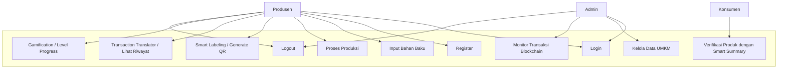
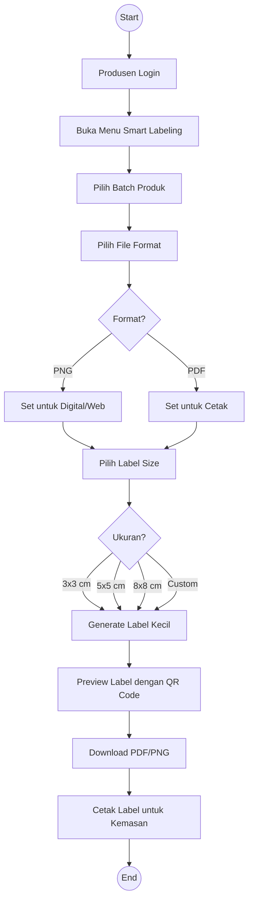
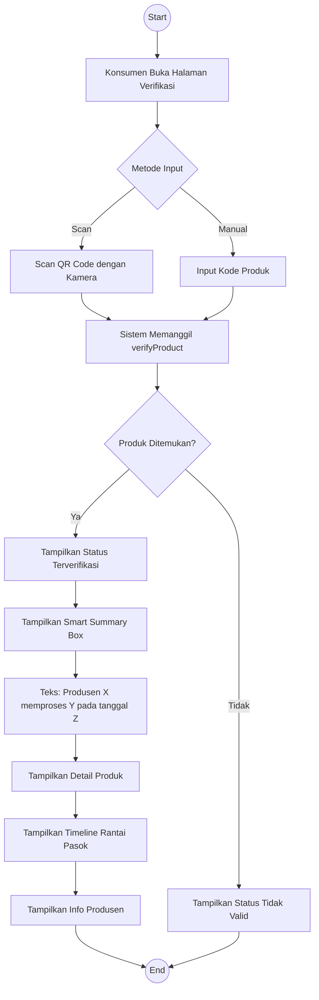
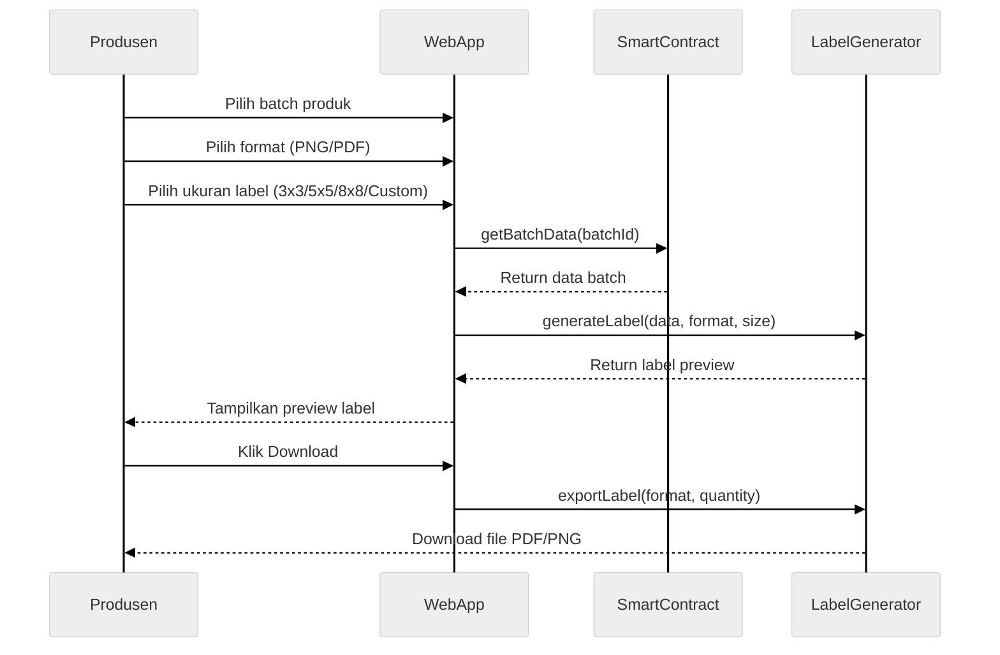
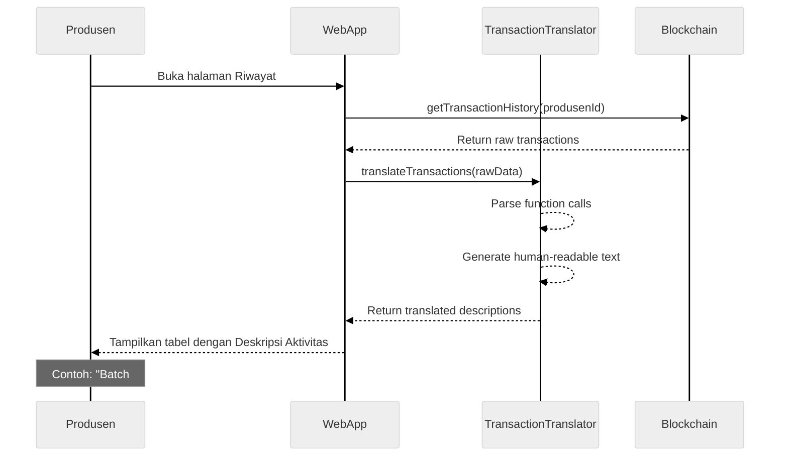
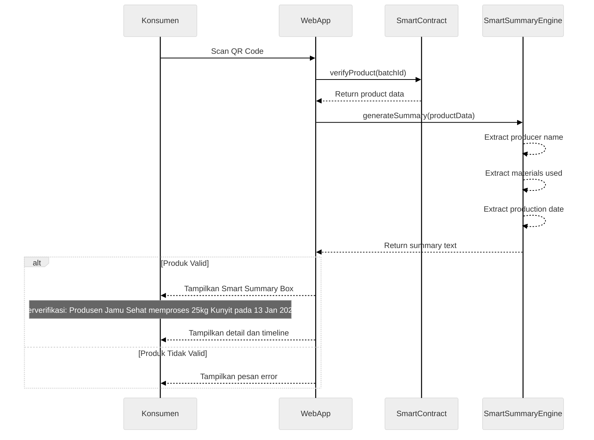
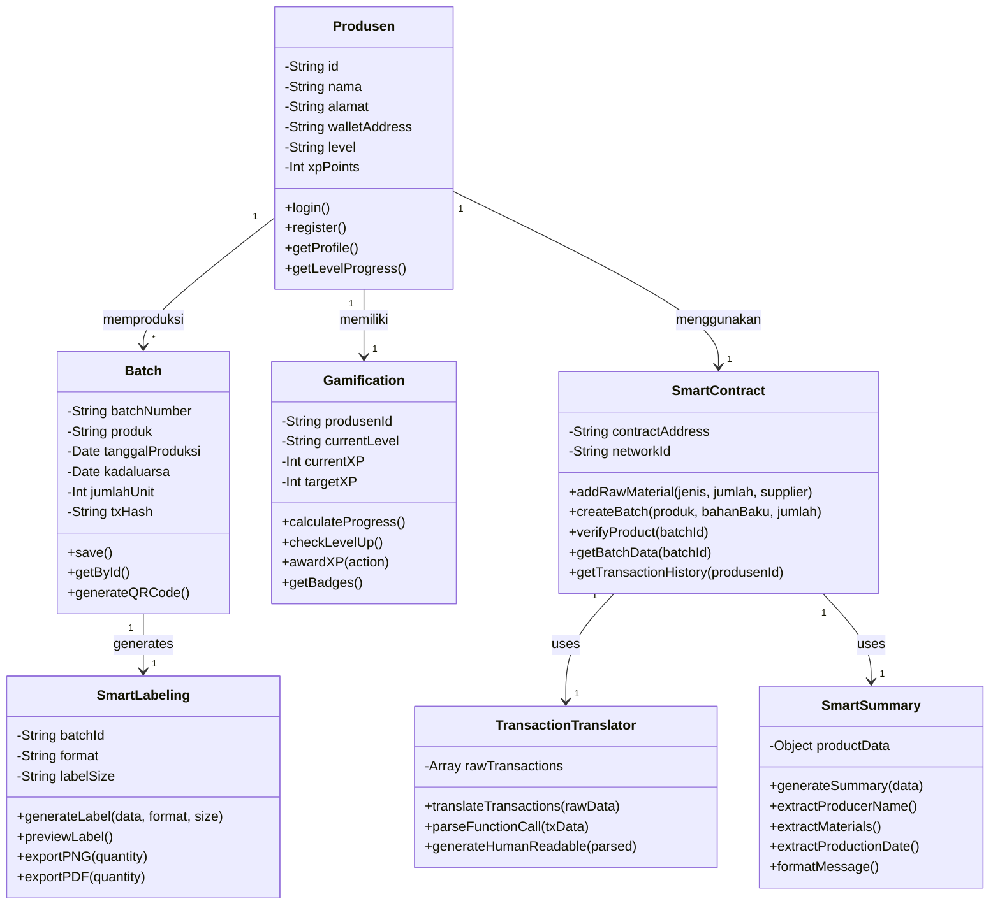
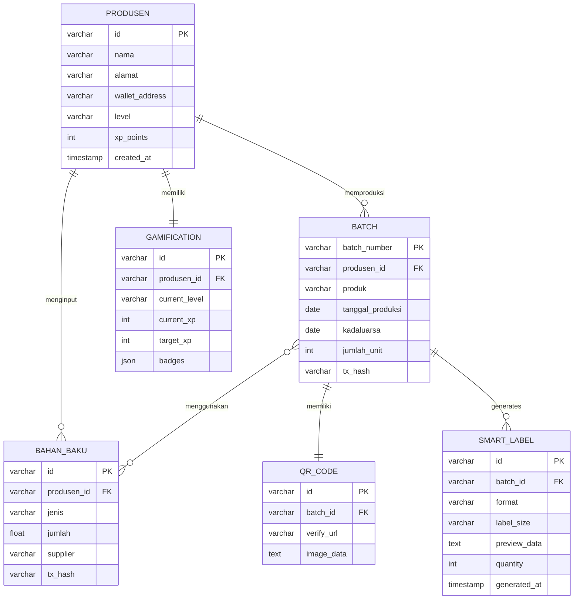

# TraceHerbal - Diagram UML (BAB IV)

## 1. Use Case Diagram

---

## 2. Activity Diagram - Smart Labeling

---

## 3. Activity Diagram - Verifikasi dengan Smart Summary

---

## 4. Sequence Diagram - Smart Labeling

---

## 5. Sequence Diagram - Transaction Translator

---

## 6. Sequence Diagram - Verifikasi dengan Smart Summary

---

## 7. Class Diagram

---

## 8. Relasi Tabel (ERD)

---

## Catatan Sinkronisasi (Updated)

| Komponen | Nama |
|----------|------|
| Aktor 1 | Produsen |
| Aktor 2 | Konsumen |
| Aktor 3 | Admin |
| Fitur Baru 1 | Smart Labeling (PDF/PNG) |
| Fitur Baru 2 | Transaction Translator |
| Fitur Baru 3 | Smart Summary |
| Fitur Baru 4 | Gamification (Level/XP) |
| Fitur Baru 5 | Logout |
| Method Input | addRawMaterial() |
| Method Verifikasi | verifyProduct() |
| Method Label | generateLabel() |
| Method Translate | translateTransactions() |
| Method Summary | generateSummary() |
| Method Logout | logout() |
