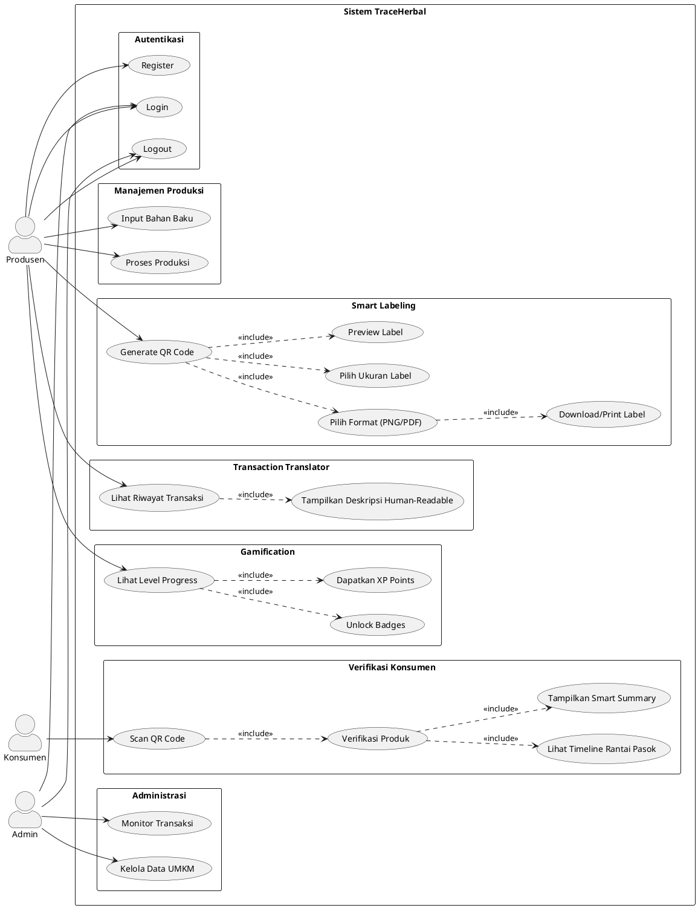
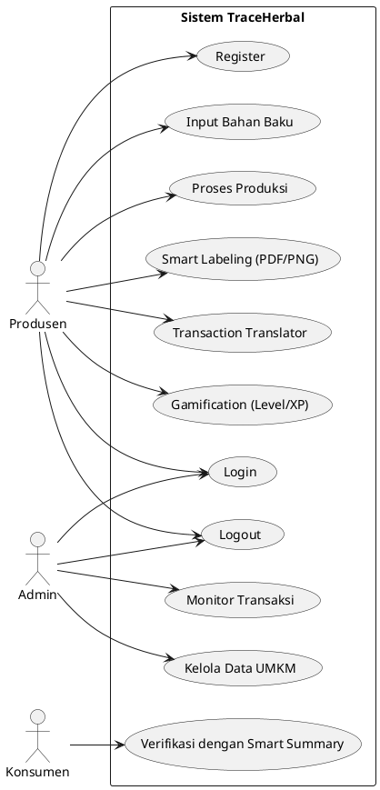
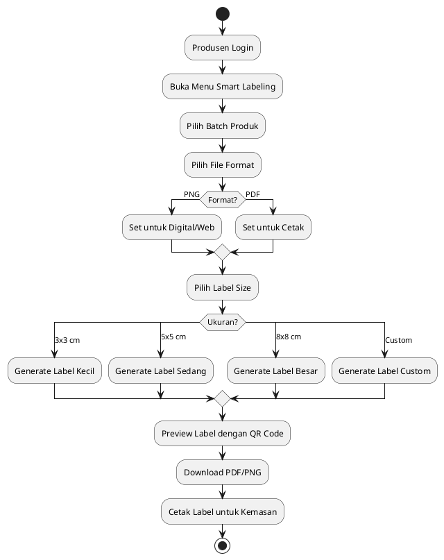
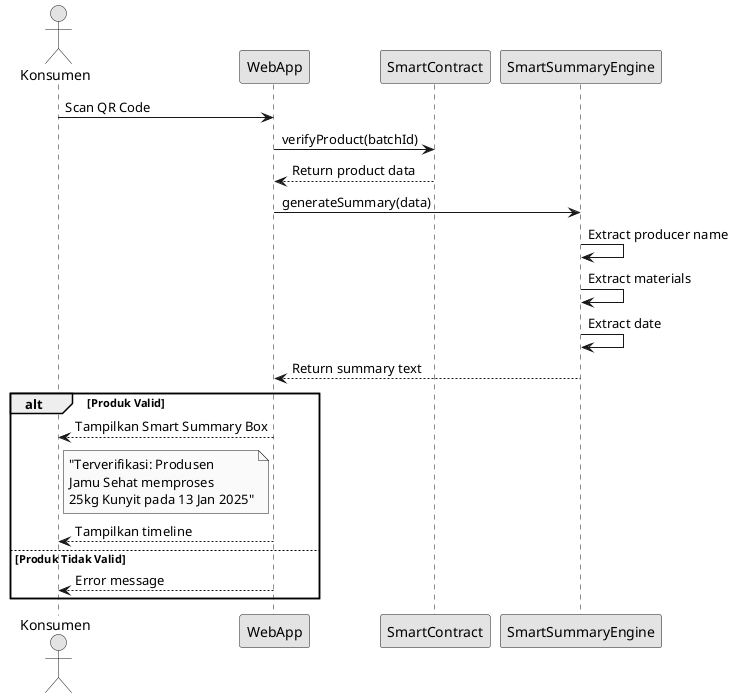
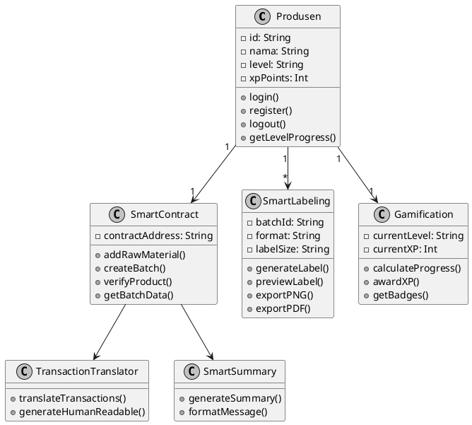

# TraceHerbal - Use Case Diagram (PlantUML)

## Cara Export ke PNG:
1. Buka https://www.plantuml.com/plantuml/uml
2. Copy-paste kode di bawah
3. Klik Generate → Download PNG

---

## Kode PlantUML (Updated dengan Fitur Baru):

---

## Use Case Diagram Sederhana (Tanpa Package):

---

## Activity Diagram - Smart Labeling (PlantUML):

---

## Sequence Diagram - Smart Summary (PlantUML):

---

## Class Diagram (PlantUML):

---

## Daftar Fitur Baru dalam Diagram

| Fitur | Deskripsi | Aktor |
|-------|-----------|-------|
| Smart Labeling | Export QR ke PNG/PDF dengan ukuran label | Produsen |
| Transaction Translator | Terjemahkan tx hash ke teks human-readable | Produsen |
| Smart Summary | Ringkasan verifikasi dalam bahasa sederhana | Konsumen |
| Gamification | Level progress (Gold/Platinum) dan XP | Produsen |
| Logout | Keluar dari sistem dan hapus session | Produsen, Admin |
